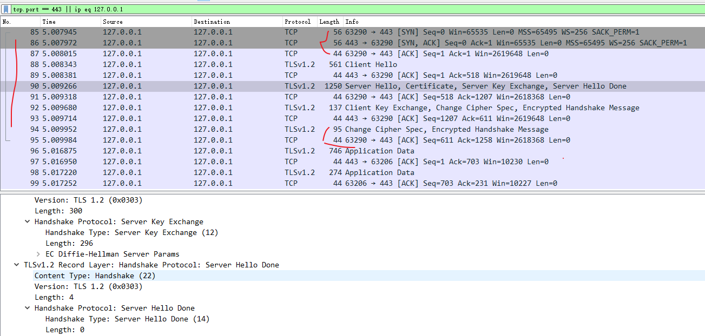
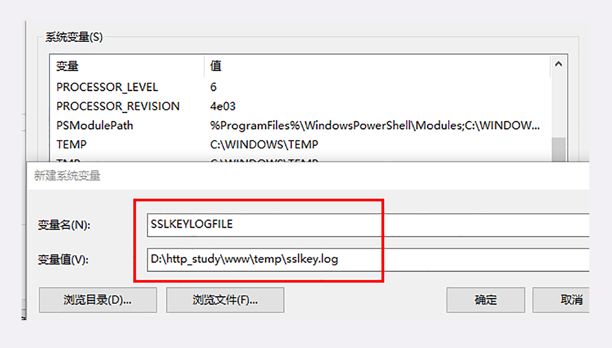
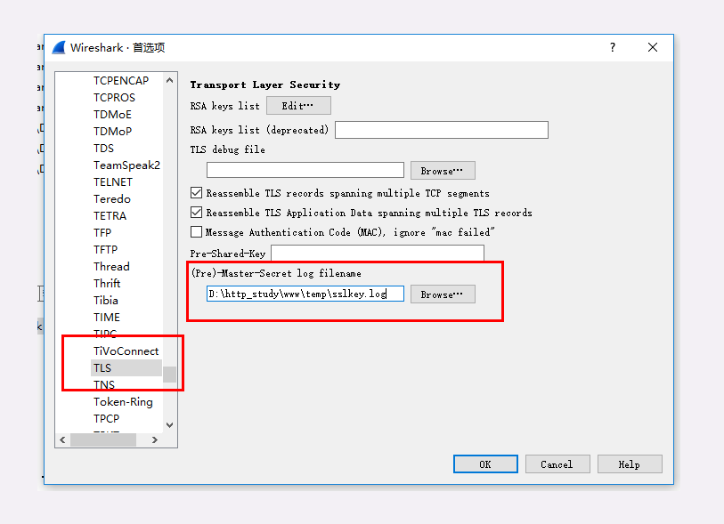
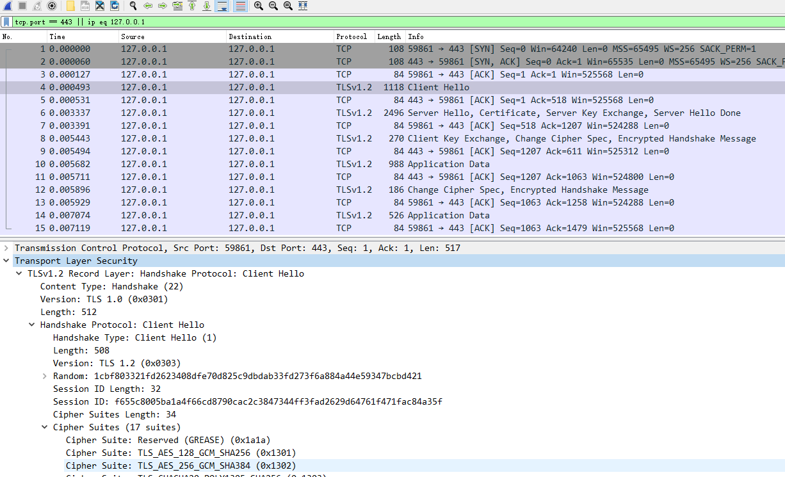
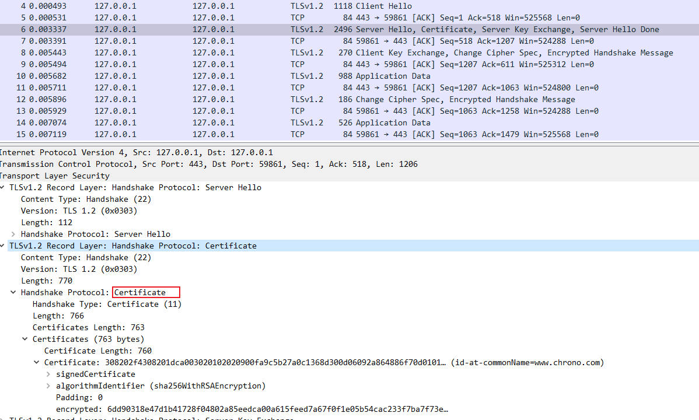

# 04 | 信任始于握手: TLS1 |2 连接过程解析

经过前几讲的介绍，你应该已经熟悉了对称加密与非对称加密、数字签名与证书等密码学知识。

有了这些知识打底，现在我们就可以正式开始研究 HTTPS 和 TLS 协议了。

## HTTPS 建立连接

当你在浏览器地址栏里键入**https** 开头的 URI，再按下回车，会发生什么呢？

回忆一下 [键入网址再按下回车，后面究竟发生了什么？](../03/01.md) 的内容，你应该知道，浏览器首先要从 URI 里提取出协议名和域名。因为协议名是 `https` ，所以浏览器就知道了端口号是默认的 443，它再用 DNS 解析域名，得到目标的 IP 地址，然后就可以使用 **三次握手与网站建立 TCP 连接** 了。

在 HTTP 协议里，建立连接后，浏览器会立即发送请求报文。但现在是 HTTPS 协议，它需要再用另外一个 「**握手**」过程，在 TCP 上建立安全连接，之后才是收发 HTTP 报文。

这个其实就类似于 mysql 服务端客户端交互协议中的登录握手了，也是当 TCP 建立连接后，还需要发送握手包协商登录密码相关的加密解密算法，验证之后确定该连接可以进行后面的通信。

这个「握手」过程与 TCP 有些类似，是 HTTPS 和 TLS 协议里最重要、最核心的部分，懂了它，你就可以自豪地说自己 「掌握了 HTTPS」。

## TLS 协议的组成

在讲 TLS 握手之前，我先简单介绍一下 TLS 协议的组成。

TLS 包含几个子协议，你也可以理解为它是由几个不同职责的模块组成，比较常用的有记录协议、警报协议、握手协议、变更密码规范协议等。

### 记录协议

**记录协议**（Record Protocol）规定了 TLS 收发数据的基本单位：记录（record）。它有点像是 TCP 里的 segment，所有的其他子协议都需要通过记录协议发出。但多个记录数据可以在一个 TCP 包里一次性发出，也并不需要像 TCP 那样返回 ACK。

### 警报协议

**警报协议**（Alert Protocol）的职责是向对方发出警报信息，有点像是 HTTP 协议里的状态码。比如，protocol_version 就是不支持旧版本，bad_certificate 就是证书有问题，收到警报后另一方可以选择继续，也可以立即终止连接。

### 握手协议

**握手协议**（Handshake Protocol）是 TLS 里最复杂的子协议，要比 TCP 的 SYN/ACK 复杂的多，浏览器和服务器会在握手过程中协商 TLS 版本号、随机数、密码套件等信息，然后交换证书和密钥参数，最终双方协商得到会话密钥，用于后续的混合加密系统。

### 变更密码规范协议

最后一个是 **变更密码规范协议**（Change Cipher Spec Protocol），它非常简单，就是一个「通知」，告诉对方，后续的数据都将使用加密保护。那么反过来，在它之前，数据都是明文的。

### TLS 的握手过程

下面的这张图简要地描述了 TLS 的握手过程，其中每一个「框」都是一个记录，多个记录组合成一个 TCP 包发送。所以，最多经过两次消息往返（4 个消息）就可以完成握手，然后就可以在安全的通信环境里发送 HTTP 报文，实现 HTTPS 协议。


## 抓包的准备工作

这次我们在实验环境里测试 TLS 握手的 URI 是 `https://www.chrono.com//26-1`，看了上面的图你就可以知道，TLS 握手的前几个消息都是明文的，能够在 Wireshark 里直接看。但只要出现了 `Change Cipher Spec` ，后面的数据就都是密文了，看到的也就会是乱码，不知道究竟是什么东西。



上述笔者抓包和上面图的流程是一致的，从最前面的标示线来看，也的确是这样。Change Cipher Spec 后面就是密文了

为了更好地分析 TLS 握手过程，你可以再对系统和 Wireshark 做一下设置，让浏览器导出握手过程中的秘密信息，这样 Wireshark 就可以把密文解密，还原出明文。

首先，你需要在 Windows 的设置里新增一个系统变量 **SSLKEYLOGFILE** ，设置浏览器日志文件的路径，比如 `D:\http_study\www\temp\sslkey.log` （具体的设置过程就不详细说了，可以在设置里搜索“系统变量”）。



然后在 Wireshark 设置 `Protocols-TLS`（较早版本的 Wireshark 里是 `SSL` ），在 `(Pre)-Master-Secret log filename` 里填上刚才的日志文件。

设置好之后，过滤器选择 **tcp port 443**，就可以抓到实验环境里的所有 HTTPS 数据了。




::: tip

日志配置后，需要知道的事情有：

1. 环境变量的配置只支持  Chrome 浏览器
2. 浏览器需要重新启动后，访问实验室环境的 https 才会往 log 中写入数据

:::

如果你觉得麻烦也没关系，GitHub 上有抓好的包和相应的日志，用 Wireshark 直接打开就行。

## ECDHE 握手过程

刚才你看到的是握手过程的简要图，我又画了一个详细图，对应 Wireshark 的抓包，下面我就用这个图来仔细剖析 TLS 的握手过程。




如果你需要自己抓包查看，笔者这边写了过滤参数是 `tcp.port == 443 || ip eq 127.0.0.1` 因为可能计算器上链接了其他的 443 端口之类的，只过滤出本机的。另外看它的握手包所在位置，不然不好对应文章中的讲解

在 TCP 建立连接之后，浏览器会首先发一个 **Client Hello** 消息，也就是跟服务器打招呼。里面有客户端的版本号、支持的密码套件，还有一个 **随机数（Client Random）** ，用于后续生成会话密钥。

```http
Handshake Protocol: Client Hello
    Version: TLS 1.2 (0x0303)
    Random: 1cbf803321fd2623408dfe…
    Cipher Suites (17 suites)
        Cipher Suite: TLS_ECDHE_RSA_WITH_AES_128_GCM_SHA256 (0xc02f)
        Cipher Suite: TLS_ECDHE_RSA_WITH_AES_256_GCM_SHA384 (0xc030)
```

这个的意思就是：我这边有这些这些信息，你看看哪些是能用的，关键的 **随机数可得留着** 。

作为礼尚往来，服务器收到 `Client Hello` 后，会返回一个 `Server Hello` 消息。把版本号对一下，也给出一个 **随机数（Server Random）** ，然后从客户端的列表里选一个作为本次通信使用的密码套件，在这里它选择了 `TLS_ECDHE_RSA_WITH_AES_256_GCM_SHA384`

```http
Handshake Protocol: Server Hello
    Version: TLS 1.2 (0x0303)
    Random: 0e6320f21bae50842e96…
    Cipher Suite: TLS_ECDHE_RSA_WITH_AES_256_GCM_SHA384 (0xc030)
```

这个的意思就是：版本号对上了，可以加密，你的密码套件挺多，我选一个最合适的吧，用椭圆曲线加 RSA、AES、SHA384。我也 **给你一个随机数，你也得留着** 

然后，服务器为了证明自己的身份，就把证书也发给了客户端（Server Certificate）



接下来是一个关键的操作，因为服务器选择了 ECDHE 算法，所以它会在证书后发送 **Server Key Exchange** 消息，里面是 **椭圆曲线的公钥（Server Params）** ，用来实现密钥交换算法，再加上自己的私钥签名认证。

```http
Handshake Protocol: Server Key Exchange
    EC Diffie-Hellman Server Params
        Curve Type: named_curve (0x03)
        Named Curve: x25519 (0x001d)
        Pubkey: 3b39deaf00217894e...
        Signature Algorithm: rsa_pkcs1_sha512 (0x0601)
        Signature: 37141adac38ea4...
```

这相当于说：刚才我选的密码套件有点复杂，所以再给你个算法的参数，和刚才的随机数一样有用，别丢了。为了防止别人冒充，我又盖了个章。

之后是 **Server Hello Done** 消息，服务器说：我的信息就是这些，打招呼完毕。

这样第一个消息往返就结束了（两个 TCP 包），结果是客户端和服务器通过明文共享了三个信息：**Client Random、Server Random 和 Server Params** 。

客户端这时也拿到了服务器的证书，那这个证书是不是真实有效的呢？

这就要用到上一讲里的知识了，开始走证书链逐级验证，确认证书的真实性，再用证书公钥验证签名，就确认了服务器的身份：刚才跟我打招呼的不是骗子，可以接着往下走。

然后，客户端按照密码套件的要求，也生成一个 **椭圆曲线的公钥（Client Params）** ，用 **Client Key Exchange** 消息发给服务器。

```http
Handshake Protocol: Client Key Exchange
    EC Diffie-Hellman Client Params
        Pubkey: 8c674d0e08dc27b5eaa…
```

现在客户端和服务器手里都拿到了密钥交换算法的两个参数（Client Params、Server Params），就用 ECDHE 算法一阵算，算出了一个新的东西，叫 **Pre-Master** ，其实也是一个随机数。

至于具体的计算原理和过程，因为太复杂就不细说了，但算法可以保证即使黑客截获了之前的参数，也是绝对算不出这个随机数的。

现在客户端和服务器手里有了三个随机数：**Client Random、Server Random 和 Pre-Master** 。用这三个作为原始材料，就可以生成用于加密会 话的主密钥，叫 **Master Secret** 。而黑客因为拿不到 `Pre-Master` ，所以也就得不到主密钥。

为什么非得这么麻烦，非要三个随机数呢？

这就必须说 TLS 的设计者考虑得非常周到了，**他们不信任客户端或服务器伪随机数的可靠性** ，为了保证真正的 **完全随机、不可预测** ，把三个不可靠的随机数混合起来，那么随机的程度就非常高了，足够让黑客难以猜测。

你一定很想知道 `Master Secret` 究竟是怎么算出来的吧，贴一下 RFC 里的公式：

```
master_secret = PRF(pre_master_secret, "master secret",
                    ClientHello.random + ServerHello.random)

```

这里的 `PRF` 就是伪随机数函数，它基于密码套件里的最后一个参数，比如这次的 SHA384，通过摘要算法来再一次强化 `Master Secret` 的随机性。

主密钥有 48 字节，但它也不是最终用于通信的会话密钥，还会再用 PRF 扩展出更多的密钥，比如客户端发送用的会话密钥（client_write_key）、服务器发送用的会话密钥（server_write_key）等等，避免只用一个密钥带来的安全隐患。

有了主密钥和派生的会话密钥，握手就快结束了。客户端发一个 **Change Cipher Spec** ，然后再发一个 **Finished** 消息，把之前所有发送的数据做个摘要，再加密一下，让服务器做个验证。

意思就是告诉服务器：后面都改用对称算法加密通信了啊，用的就是打招呼时说的 AES，加密对不对还得你测一下。

服务器也是同样的操作，发 **Change Cipher Spec** 和 **Finished** 消息，双方都验证加密解密 OK，握手正式结束，后面就收发被加密的 HTTP 请求和响应了。

## RSA 握手过程

整个握手过程可真是够复杂的，但你可能会问了，好像这个过程和其他地方看到的不一样呢？

刚才说的其实是如今主流的 TLS 握手过程，这与传统的握手有两点不同。

第一个，使用 ECDHE 实现密钥交换，而不是 RSA，所以会在服务器端发出 `Server Key Exchange` 消息。

第二个，因为使用了 ECDHE，客户端可以不用等到服务器发回 `Finished` 确认握手完毕，立即就发出 HTTP 报文，省去了一个消息往返的时间浪费。这个叫 **TLS False Start** ，意思就是抢跑，和 `TCP Fast Open` 有点像，都是不等连接完全建立就提前发应用数据，提高传输的效率。

实验环境在 440 端口（`https://www.chrono.com:440/26-1`）实现了传统的 RSA 密钥交换，没有 `False Start` ，你可以课后自己抓包看一下，这里我也画了个图。


大体的流程没有变，只是 `Pre-Master` 不再需要用算法生成，而是客户端直接生成随机数，然后用服务器的公钥加密，通过 **Client Key Exchange** 消息发给服务器。服务器再用私钥解密，这样双方也实现了共享三个随机数，就可以生成主密钥。

这个相对简单一点，下面是流程：

1. 客户端连上服务端

2. 服务端发送 CA 证书给客户端

   发送的是一个 CA 链，不包含 ROOT 证书

3. 客户端验证该证书的可靠性

   解析 CA 链，用链条上的 CA 进行验证，一层层地验证，直到找到根证书，就能够确定证书是可信的

4. 客户端从 CA 证书中取出公钥

5. 客户端生成一个随机密钥 k，并用这个公钥加密得到 `k*`

6. 客户端把 `k*` 发送给服务端

7. 服务端收到 `k*` 后用自己的私钥解密得到 k

8. 此时双方都得到了密钥 k，协商完成

9. 后续使用密钥 `k*` 加密信息

攻击方式：

- 防偷窥（嗅探）

  攻击者虽然可以监视网络流量并拿到公钥，但是 **无法** 通过公钥推算出私钥（这点由 RSA 算法保证）

  攻击者虽然可以监视网络流量并拿到 `k*`，但是攻击者没有私钥，**无法解密 `k*`** ，因此也就无法得到 k

- 如何防范篡改（假冒身份）

  如果攻击者在第 2 步篡改数据，伪造了证书，那么客户端在第 3 步会发现（这点由证书体系保证）

  如果攻击者在第 6 步篡改数据，伪造了 `k*` ，那么服务端收到假的 `k*` 之后，解密会失败（这点由 RSA 算法保证）。服务端就知道被攻击了。

## 双向认证

到这里 TLS 握手就基本讲完了。

不过上面说的是 **单向认证** 握手过程，只认证了服务器的身份，而没有认证客户端的身份。这是因为通常单向认证通过后已经建立了安全通信，用账号、密码等简单的手段就能够确认用户的真实身份。

但为了防止账号、密码被盗，有的时候（比如网上银行）还会使用 U 盾给用户颁发客户端证书，实现 **双向认证** ，这样会更加安全。

双向认证的流程也没有太多变化，只是在 **Server Hello Done** 之后，**Client Key Exchange** 之前，客户端要发送 **Client Certificate** 消息，服务器收到后也把证书链走一遍，验证客户端的身份。

## 小结

今天我们学习了 HTTPS/TLS 的握手，内容比较多、比较难，不过记住下面四点就可以。

1. HTTPS 协议会先与服务器执行 TCP 握手，然后执行 TLS 握手，才能建立安全连接；
2. 握手的目标是安全地交换对称密钥，需要三个随机数，第三个随机数 `Pre-Master` 必须加密传输，绝对不能让黑客破解；
3. `Hello` 消息交换随机数，`Key Exchange` 消息交换 `Pre-Master` ；
4. `Change Cipher Spec` 之前传输的都是明文，之后都是对称密钥加密的密文。

## 课下作业

1. 密码套件里的那些算法分别在握手过程中起了什么作用？
2. 你能完整地描述一下 RSA 的握手过程吗？
3. 你能画出双向认证的流程图吗？

## 拓展阅读

- TLS 中记录协议原本定义有压缩方式，但后来发现存在安全漏洞（CRME 攻击），所以现在这个字段总是 NULL，即不压缩。
- 在 TLS1.2 里,客户端和随机数的长度都是 28 字节，前面的四个字节是 UNX 时间戳，但并没有实际意义。
- Chrome 开发者工具的 `Security` 面板里可以看到 Https 握手时选择的版本号、密码套件和椭圆曲线，例如 `ECDHE_RSA With X25519，and AES_256_GCM`
- ECDHE 即 「短暂-椭圆曲线-迪菲-赫尔曼」(ephemeral Elliptic Curve Diffe-Hellman) 算法，使用椭圆曲线增强了DH 算法的安全性和性能，公钥和私钥都是临时生成的。
- 在 Wireshark 抓包里你还会看见 `Session iD`、`Extension` 等字段，涉及会话复用和扩展协议，后面会讲到。