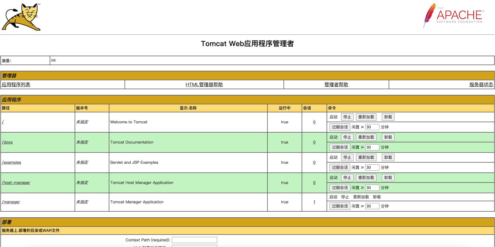

# Tomcat-manager 监控 Tomcat

tomcat 自带的监控工具。低版本默认开启，高版本默认关闭（因为一些安全原因）。

- 文档：`docs/manager-howto.html`
- 配置文件：
  1. `conf/tomcat-users.xml` 添加用户
  2. `conf/Catalina/localhost/manager.xml`配置运行的远程连接
  3. 重启 tomcat

为了学习后面的课程，笔者下载了 [tomcat 8.5.6](https://tomcat.apache.org/download-80.cgi)，它的文档和二进制有分开的包可以下载。

`conf/tomcat-users.xml` 添加用户，直接使用了他们默认的配置文件

```xml
<?xml version="1.0" encoding="UTF-8"?>
<tomcat-users xmlns="http://tomcat.apache.org/xml"
              xmlns:xsi="http://www.w3.org/2001/XMLSchema-instance"
              xsi:schemaLocation="http://tomcat.apache.org/xml tomcat-users.xsd"
              version="1.0">
  <role rolename="tomcat"/>
  <role rolename="manager-gui"/>
  <role rolename="manager-status" />
  <user username="tomcat" password="123456" roles="tomcat,manager-gui,manager-status"/>

</tomcat-users>

```

- **manager-gui** 访问 HTML 界面。
- **manager-status** 仅访问 服务器状态 页面。
- **manager-script**  访问本文档中描述的工具友好的纯文本界面以及 服务器状态 页面。
- **manager-jmx** 访问 JMX 代理界面和 服务器状态 页面。

上述配置文件，配置了三个角色，一个用户，并给该用户分配了角色。


`conf/Catalina/localhost/manager.xml` 配置运行的远程连接，这个文件默认是不存在的，需要手动创建它，它的规则是 `$CATALINA_BASE/conf/[enginename]/[hostname]`

```xml
<?xml version="1.0" encoding="UTF-8"?>
<Context privileged="true" antiResourceLocking="false"
         docBase="${catalina.home}/webapps/manager">
  <CookieProcessor className="org.apache.tomcat.util.http.Rfc6265CookieProcessor"
                   sameSiteCookies="strict" />
     <Valve className="org.apache.catalina.valves.RemoteAddrValve"
                allow="127\.0\.0\.1"/>
</Context>
```

以上配置是文档中的配置，配置了允许访问这个管理界面的 IP 为 127.0.1.1 也就是本机才能访问。

启动 tomcat 

```bash
mrcode@mrcode bin % ./catalina.sh run
```

然后访问：`http://127.0.0.1:8080/manager/html` 就弹出 http basic 认证框弹出，输入上面配置文件配置的用户名和密码，就进入了管理界面

 

服务器状态里面就有内存和线程信息


