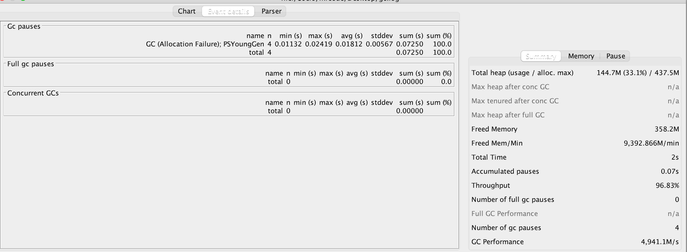

# Tomcat 的 GC 调优实战

## GC 调优步骤

1. 打印 GC 日志
2. 根据日志得到关键性能指标
3. 分析 GC 原因，调优 JVM 参数

## 初始设置

```bash
# 禁用声明式 GC 语法，在程序只中显示的调用 System.gc，禁用这个，不然可能会影响 GC 的表现
-XX:+DisableExplicitGC
# 当堆溢出的时候，记录快照
-XX:+HeapDumpOnOutofMemoryError
-XX:HeapDumpPath=$CATALINA HOME/logs/
# 打印 GC 日志
-XX:+PrintGCDetails
-XX:+PrintGCTimeStamps
-XX:+PrintGCDateStamps
-Xloggc:$SCATALINA_HOME/logs/gc.log
```

## Parallel GC 调优的指导原则

- 除非确定，否则不要设置最大堆内存
- 优先设置吞吐量目标
- 如果吞吐量目标达不到，调大最大内存，不能让 OS 使用 Swap，如果仍然达不到，降低目标
- 吞吐量能达到，GC 时间太长，设置停顿时间的目标


下面记录下初始参数下的性能指标

| 吞吐量 <br/> Throughput | 最小停顿时间<br/>Min Pause | 最大停顿时间<br/>Max Pause | 平均停顿时间<br/> Avg Pause | YGC 总次数<br/> Number of gc pauses | FullGC 总次数<br/>Number of full gc pauses |
| :---------------------: | :------------------------: | :------------------------: | --------------------------- | ----------------------------------- | ------------------------------------------ |
|         96.19%          |          0.00625s          |          0.03446s          | 0.01464s                    | 5                                   | 1                                          |

从上图可以看到由于 Metadata 区导致了一次 YGC 和 一次 FullGC，我们尝试调大 Metadata 区的大小。


从上图所知， Perm heap 其实就是 Metadata 区（该软件的一些含义可以在他的官方文档上查看），这里只占用了 20.1 M，我们尝试调大它的空间

```
-XX:MetaspaceSize=64M
```

调整为 64M 后，再次查看他的 GC 日志



| 吞吐量 <br/> Throughput | 最小停顿时间<br/>Min Pause | 最大停顿时间<br/>Max Pause | 平均停顿时间<br/> Avg Pause | YGC 总次数<br/> Number of gc pauses | FullGC 总次数<br/>Number of full gc pauses |        |
| :---------------------: | :------------------------: | :------------------------: | --------------------------- | ----------------------------------- | ------------------------------------------ | ------ |
|         96.19%          |          0.00625s          |          0.03446s          | 0.01464s                    | 5                                   | 1                                          | 调整前 |
|         96.83%          |          0.01132s          |          0.02419s          | 0.01812s                    | 4                                   | 0                                          | 调整后 |

从结果来看，整体是变好了，Metadata 区的两次 YGC 和 FullGC 没有了

后面的参数就不一一尝试了，总结下：

- 设置 Metaspace 大小

  `-XX:MetaspaceSize=64M -XX:MaxMetaspaceSize=64M`

- 添加吞吐量和停顿时间参数

  `-XX:GCTimeRatio=99 -XX:MaxGCPauseMillis=100`

  不一定调整之后性能会变高，所以需要去尝试调整，然后查看日志的分析反馈

- 修改动态扩容增量

  `-XX:YoungGenerationSizeIncrement=30`  默认值是 20%，这里增加 10%

  由于发现产生了 4 次的 YGC，增加 Young 区大小，应该可以消除

## G1 GC 最佳实践

- 年轻代大小：

  避免使用 `-Xmn`、`-XX:NewRatio` 等显示设置 Young 区大小，会覆盖暂停时间目标

- 暂停时间目标：

  暂停时间不要太严苛，其吞吐量目标是 90% 的应用程序时间和 10% 的垃圾回收时间，太严苛会直接影响到吞吐量

MixGC 调优：

- `-XX:InitiatingHeapOccupancyPercent`
- `-XX:G1MixedGCLiveThresholdPercent`、`-XX:G1HeapWastePercent`
- `-XX:G1MixedGCCountTarget`
- `-XX:G1OldCSetRegionThresholdPercent`

这些在垃圾器一章节有讲解过，这里还是针对那章节的知识点，进行实战。

GC 调优就是根据日志的反馈，去针对的改变可能的参数，增加它的相关性能指标

::: tip 重要的事情

这里的调整思路，包括参数含义，在官方文档里面都有写，这里入个门，详细的去对应的学

:::